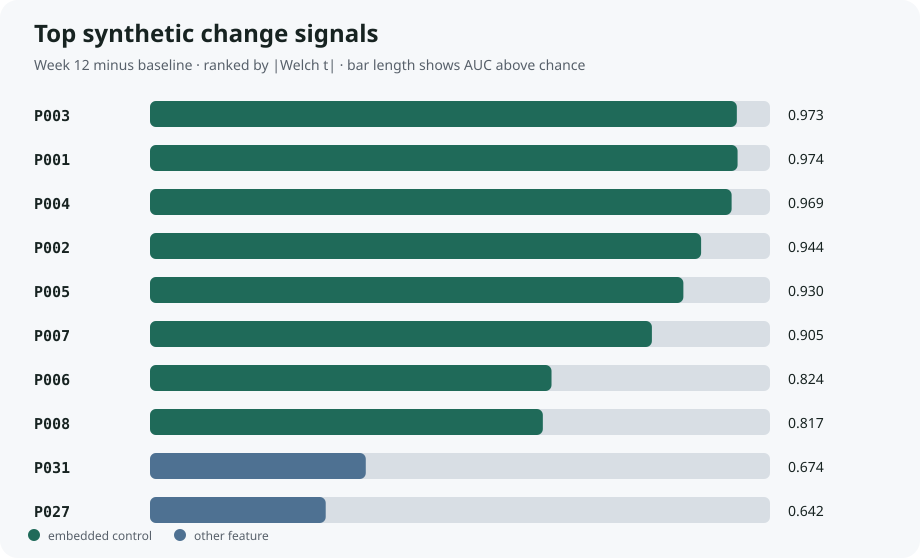

# Reproducible longitudinal proteomics demo

[](https://github.com/maymm3/multiomics-biomarker-demo/actions/workflows/ci.yml)

An inspectable, standard-library Python workflow for quality-checking longitudinal protein measurements, correcting a simple batch shift, calculating paired changes, and ranking group-associated features.

This repository is a portfolio demonstration by [May Myat Mon](https://github.com/maymm3). It reflects the structure of real multi-omics work while protecting research participants and institutional intellectual property.

## Try Signal Atlas

[Open the free Signal Atlas web app](https://maymm3.github.io/multiomics-biomarker-demo/) to explore the recovered synthetic signals or calculate Cohen's *d* from two groups of summary values.

The app runs entirely in the browser. Values entered into the calculator are not uploaded, stored, or shared. Results are exploratory and are not clinical recommendations.



## What is real—and what is synthetic

- The code is runnable and tested.
- The dataset is deterministically generated: 72 synthetic participants, 40 protein features, and three timepoints.
- P001-P008 are intentional positive controls used to test signal recovery.
- No patient, employer, or unpublished study data is included.
- The output is not a clinical result, medical device, or diagnostic recommendation.

## Reproduce the result

Only Python 3.10+ is required to reproduce the scientific pipeline; there are no third-party Python packages. The separate browser-tool tests require Node.js 20+.

```bash
python src/generate_data.py
python src/analyze.py
python -m unittest discover -s tests -v
```

Or run everything with:

```bash
make reproduce
```

Expected outputs:

- [`results/report.md`](results/report.md) — concise generated analysis report
- [`results/feature_ranking.csv`](results/feature_ranking.csv) — complete ranked feature table
- [`results/summary.json`](results/summary.json) — machine-readable QC and headline results
- [`results/top_features.svg`](results/top_features.svg) — dependency-free generated result visualization

## Workflow

```text
deterministic synthetic generator
              ↓
schema and missingness checks
              ↓
within-protein/timepoint batch centering
              ↓
paired baseline → week-12 changes
              ↓
effect size + Welch statistic + univariate AUC
              ↓
ranked table + JSON summary + Markdown report
```

## Design decisions

- **Long format:** mirrors common assay exports and makes validation explicit.
- **Paired deltas:** respect the longitudinal design instead of treating observations as independent.
- **Positive controls:** give CI a scientific behavior test, not merely a “script ran” check.
- **Transparent limits:** batch correction and univariate ranking are intentionally understandable; a real analysis would add design-aware modelling, multiplicity control, sensitivity analysis, and external validation.

## Repository quality controls

CI regenerates the data and results, runs unit tests, and fails if committed outputs cannot be reproduced byte-for-byte. See [`CONTRIBUTING.md`](CONTRIBUTING.md) for the review checklist.

## Contact

I’m open to bioinformatics, computational biology, research-data, and PhD opportunities. For a professional inquiry, contact [May.Myat@autonoma.cat](mailto:May.Myat@autonoma.cat) or use the structured form on my [GitHub profile](https://github.com/maymm3).

## License

Code is available under the [MIT License](LICENSE). The synthetic dataset is generated solely for demonstration.
